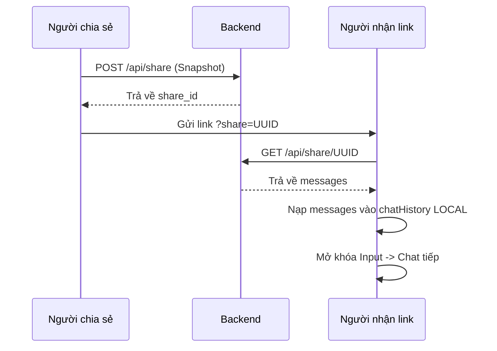

# Phân tích & Thiết kế Chức năng Chia sẻ Đoạn chat 🐝📡

Tài liệu này mô tả thiết kế kỹ thuật cho tính năng "Share Chat", cho phép người dùng tạo link công khai để chia sẻ nội dung cuộc hội thoại với người khác (tương tự ChatGPT/Gemini).

## 1. Mục tiêu
- Lưu trữ một "bản chụp" (snapshot) của cuộc hội thoại hiện tại.
- Tạo mã định danh duy nhất (UUID) cho mỗi lần chia sẻ.
- Hiển thị nội dung đã chia sẻ một cách trực quan cho người nhận link.

---

## 2. Kiến trúc Kỹ thuật

### A. Tầng Lưu trữ (Persistence)
Chúng ta sẽ sử dụng **Firebase Firestore** (phiên bản Spark - Miễn phí) để lưu trữ các bản ghi chat.
- **Lý do chọn:** 
    - **Dễ triển khai:** Tích hợp cực nhanh với Python thông qua `firebase-admin`.
    - **Dung lượng:** 1GB miễn phí (Đủ cho nhu cầu khởi đầu, lưu được hàng chục ngàn đoạn chat).
    - **Cấu trúc:** NoSQL Document cực kỳ linh hoạt cho dữ liệu Chat History (JSON).
- **Cấu trúc dữ liệu trên Firestore (Collection: `shared_chats`):**
  ```json
  {
    "id": "uuid-string", // ID dùng làm link chia sẻ
    "createdAt": "timestamp",
    "messages": [ 
      { "sender": "user", "text": "..." },
      { "sender": "ai", "text": "...", "map_data": {...} }
    ],
    "user_info": { "name": "...", "avatar": "..." }
  }
  ```

### B. Tầng API (Backend - FastAPI)
Thêm 2 endpoint mới trong `main.py`:
1.  **POST `/api/share`**:
    - Nhận vào mảng `chatHistory`.
    - Sinh mã UUID ngẫu nhiên.
    - Lưu vào database/file.
    - Trả về `share_id`.
2.  **GET `/api/share/{share_id}`**:
    - Truy xuất dữ liệu từ mã ID.
    - Trả về mảng messages để frontend hiển thị.

### C. Giao diện (Frontend - script_app.js & index.html)
1.  **Nút Chia sẻ:** Thêm icon chia sẻ (phía trên khung chat).
2.  **Hộp thoại Link:** Hiển thị link định dạng `https://domain.com/?share=uuid-xyz`.
3.  **Chế độ Tiếp tục (Chat Forking):**
    - Khi nhận link có tham số `?share=...`.
    - Tải dữ liệu từ API.
    - **Nâng cấp:** Thay vì khóa UI, hệ thống sẽ nạp dữ liệu này vào `chatHistory` hiện tại của người dùng.
    - Người nhận có thể gõ tiếp và hệ thống sẽ coi đó là một "nhánh" (fork) mới của cuộc hội thoại ban đầu.
    - **Thông báo:** "Bạn đã nạp cuộc hội thoại được chia sẻ. Bạn có thể tiếp tục chat từ đây!"

---

## 3. Quy trình Thực hiện (Workflow)



---

## 4. Kế hoạch Triển khai (Roadmap)
1.  [ ] **Backend:** Tạo model Pydantic và dịch vụ lưu trữ file JSON.
2.  [ ] **Backend:** Viết 2 API endpoints.
3.  [ ] **Frontend:** Thêm UI nút Share và Modal hiển thị Link.
4.  [ ] **Frontend:** Xử lý Logic nạp dữ liệu khi có tham số `share` trên URL.
5.  [ ] **Kiểm thử:** Đảm bảo link chia sẻ mở được trên trình duyệt ẩn danh.

---

> [!IMPORTANT]
> Vì mục tiêu bảo mật, các thông tin nhạy cảm của người dùng (như Token Zalo nếu có) sẽ KHÔNG được lưu vào bản snapshot chia sẻ. Chỉ lưu nội dung văn bản và cấu trúc thẻ sản phẩm.
